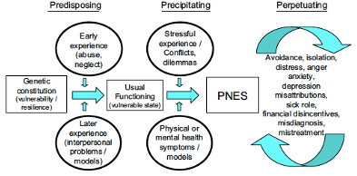
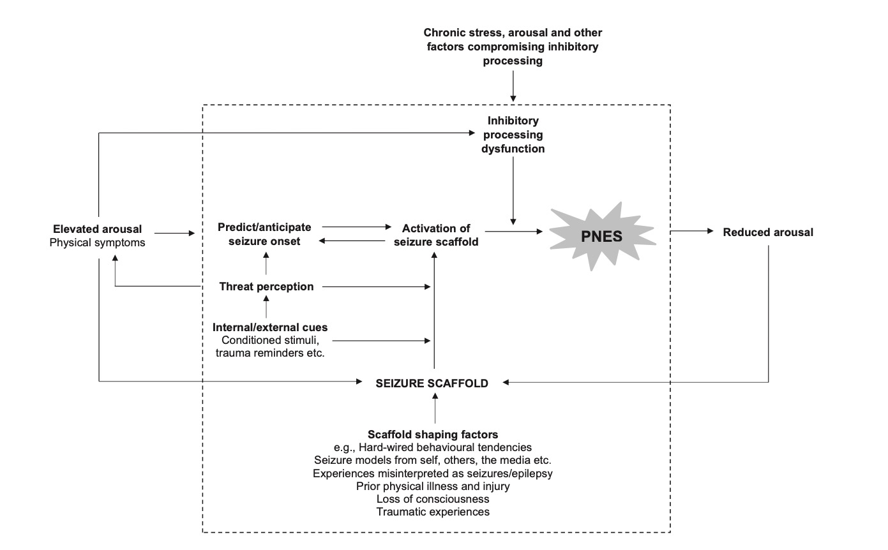
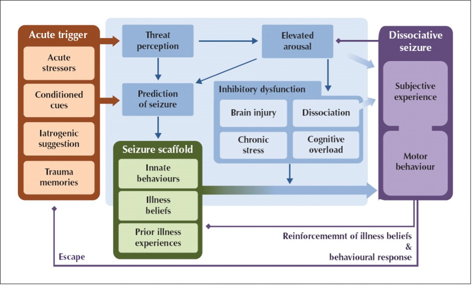
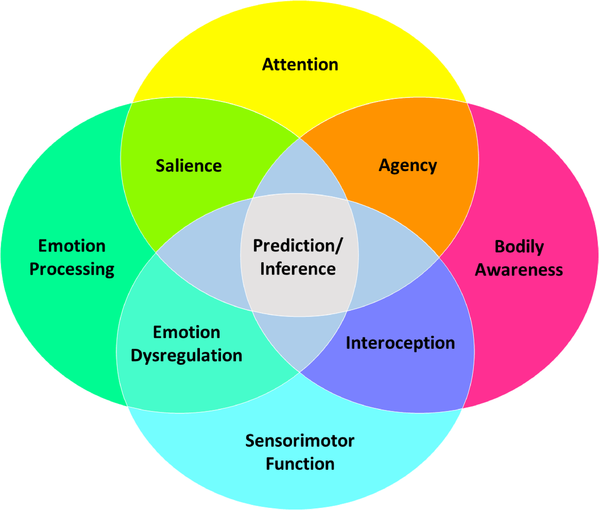
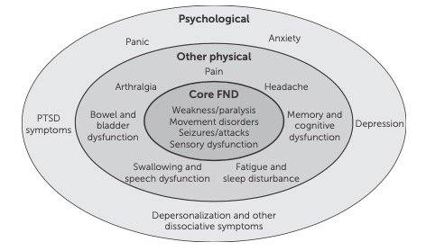
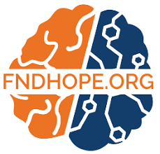
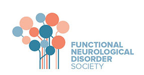

class: inverse, left,
background-image: url(https://images.unsplash.com/photo-1607688387751-c1e95ae09a42?ixid=MnwxMjA3fDB8MHxzZWFyY2h8ODF8fGJyYWlufGVufDB8fDB8fA%3D%3D&ixlib=rb-1.2.1&auto=format&fit=crop&w=500&q=60)
background-size: contain
background-position: right

```{r include=FALSE}
options(htmltools.dir.version = FALSE)

library(xaringan)
library(xaringanExtra)
library(dplyr)
library(gganimate)
library(ggExtra)
library(xaringanthemer)
library(RColorBrewer)
library(vembedr)
#library(tweetrmd)
#library(emo)

xaringanExtra::use_editable()
xaringanExtra::use_panelset()
xaringanExtra::use_freezeframe()
xaringanExtra::use_webcam()
xaringanExtra::use_fit_screen()
xaringanExtra::use_progress_bar(color = "red", location = "top")
xaringanExtra::use_tile_view()
xaringanExtra::use_scribble()
xaringanExtra::use_share_again()
```


.left[
# Functional Neurological<br>Disorders
]

.pull-left[
.center[.large[
An introduction to working with functional neurological disorders (FND) for psychology and medicine

*for:*

**North Staffordshire Combined Healthcare NHS Trust**
]

https://fnd-for-combined.netlify.app]
          ]
          
???
- Welcome
- Here is the url (for links, videos and up-to-date teaching).

---
class: inverse, center, middle

.pull-left[


## Abi Methley

### Senior Clinical Psychologist

#### .fade[Stoke Neuropsychology Department<br><br>North Staffordshire Combined Healthcare NHS Trust]

]


.pull-right[


## Chris Gaskell

### Senior Clinical Psychologist

#### .fade[Stoke Neuropsychology Department<br><br>North Staffordshire Combined Healthcare NHS Trust]

[`r icons::icon_style(icons::fontawesome("twitter"), scale = 1.5)` ](https://twitter.com/chrisgaskell92)
[`r icons::icon_style(icons::fontawesome("github"), scale = 1.5)`](https://github.com/chris-gaskell)
[`r icons::icon_style(icons::fontawesome("envelope"), scale = 1.5)`](mailto:c.gaskell@sheffield.ac.uk)
[`r icons::icon_style(icons::fontawesome("graduation-cap"), scale = 1.5)`](https://scholar.google.com/citations?user=gQuNwfYAAAAJ&hl=en&authuser=1&oi=ao)
[`r icons::icon_style(icons::fontawesome("researchgate"), scale = 1.5)`](https://www.researchgate.net/profile/Chris-Gaskell-2)

]

???
- Introductions
- How to contact us

---
class: top, left, inverse
background-image: url("https://images.unsplash.com/photo-1538166261293-9230c2a7ee36?ixid=MnwxMjA3fDB8MHxzZWFyY2h8MXx8d2FybmluZ3xlbnwwfHwwfHw%3D&ixlib=rb-1.2.1&auto=format&fit=crop&w=500&q=60")
background-position: 90% 50%
background-size: 40% 70%

## Disclaimers

- .large[Emotionally pertinent <br>areas]&ensp;
`r icons::icon_style(icons::fontawesome("frown-open", style = "solid"), scale = 1.5, fill = "white")`
- .large[Potentially distressing <br>videos]&ensp;
`r icons::icon_style(icons::fontawesome("video", style = "solid"), scale = 1.5, fill = "white")`
- .large[Not about emergency <br>treatment response]&ensp;
`r icons::icon_style(icons::fontawesome("hand-paper", style = "solid"), scale = 1.5, fill = "white")`
- .large[We are learning too]&ensp;
`r icons::icon_style(icons::fontawesome("question", style = "solid"), scale = 1.5, fill = "white")`


???
- The content of what we are going to be discussing maybe distressful for some people here. We do not personally know what affiliations you have to this area so please feel free to look after yourself in anyway you need to.
- I am going to be showing some videos of people experiencing functional symptoms and who are also experiencing acute distress, if anyone would sooner not watch these videos then you are welcome to turn off your screens while we are watching them. I'll give people a warning when there is going to be a video and then you can decide for yourself.
- We are not here to Change your acute management of this condition. Neither of us are medically trained, so we will not know how to respond to someone experiencing a seizure. Instead, what is teaching is far is to give you all some understanding of what the condition is, and to discuss some of the challenges of living with this condition.


--- 
name: contents-slide
class: top, left
background-image: url(files/img/make-plan.jpg)
background-position: 120% 70%
background-size: contain

# Contents

.pull-left[
.large[
- [**What is FND?**](#what-slide)                   <br> .small[09:00-00:00]
- [**What is Happening?**](#what-slide)             <br> .small[00:00-00:00]
- [**Experience**](#experience-slide)               <br> .small[00:00-00:00]
- [**Interventions**](#therapeutic-slide)           <br> .small[00:00-00:00]
- [**Case Examples**](#examples-slide)              <br> .small[00:00-00:00]
- [**Resources**](#resources-slide)
]

.footnote[

]]

.pull-right[
.footnote[
Note: [**underlined text**]()<br> contain links.

A <a href="https://github.com/chris-gaskell/fnd-for-paramedics/blob/main/output/index.pdf">pdf</a> of this presentation<br> is also available.
]]

---
name: what-slide
class: inverse, middle, center
# What is FND?

---
class: top, left

## So What is This All About?


--

- **FND** = Functional Neurological Disorder
- **NEAD** = Non Epileptic Attack Disorder

--


`r embed_youtube("Dy3XLo7dVQI", width = 750, height = 400) %>% use_start_time("0m04s")`

.small[Video by Massachussets General Hospital


???
- Brief explanation. epilepsy but without the same underlying electrical processes. Different brain structural changes.
- Really important because treatments for seizures are not effective for functional seizures.
- FND is an umbrella term that captures all the different types of seemingly neurological symptoms.

---

##  <b>Definitions:</b> FND `r icons::icon_style(icons::fontawesome("umbrella", style = "solid"), scale = 1.5, fill = "black")`

.blue[Functional Neurological Symptoms Disorder:]
- Added as an inclusion term to Conversion Disorder in the DSM-5 (2013).
- Diagnosis requires FND motor and/or sensory findings.
- Evidence of incompatibility between  symptom and recognized neurological/medical conditions” (APA, 2013, Stone et al., 2010b).
- The symptoms must impair social and/or occupational functioning or lead individuals to seek a medical opinion. No duration or severity criteria, or explicit rules for exclusion based on additional symptoms.

.blue[Dissociative Neurological Symptom Disorder:]
- Used in the ICD-11 despite much pushback from FND charities and specialists around the world.

???
The term functional has been used to describe symptoms which impacts upon neurological function but which do not have the same underlying pathological abnormality.

???
- DSM-5 is the main book for classifying and diagnosing psychiatric conditions.
- 

---
##  <b>Definitions:</b> Functional seizures

- One manifestation or constellation of FND.
- In DSM-5, functional seizures are classified as a form of conversion disorder, or functional neurological symptom disorder, with the term "functional" referring to an impairment of normal bodily functioning.
- Disruption of usually integrated functions of consciousness, memory, id, or perception (amnesia, fugue, dissociative id disorder, depersonalisation disorder) (Goldstein et al, 2000)

- People with NEAD experience **episodes of temporary loss of control and/ or awareness**

---
exclude: true
background-image: url(files/img/tloc-esc.png)
background-position: 100% 50%
background-size: contain

.footnote[
Taken from: <a href="https://www.researchgate.net/publication/323856711_2018_ESC_Guidelines_for_the_diagnosis_and_management_of_syncope">ESC Guidelines for the diagnosis and management of syncope, 2018</a>]

???
---

class: inverse

## Videos of FND

.panelset[

.panel[.panel-name[fs 1]
.center[
`r embed_youtube("MA1EYAg9y5k", width = 800, height = 450) %>% use_start_time("2m54s")`
]
] <!--CLip 1-->

.panel[.panel-name[fs 2]
`r embed_youtube("MA1EYAg9y5k", width = 800, height = 450) %>% use_start_time("13m20s")`
] <!--Clip 2-->

.panel[.panel-name[fs 3]
`r embed_youtube("i_1U9lNi314", width = 800, height = 450) %>% use_start_time("0m59s")`
] <!--Clip 3-->

.panel[.panel-name[fs 4]
`r embed_youtube("MdOCo4hD4zI", width = 800, height = 450) %>% use_start_time("0m44s")`
] <!--Clip 4-->

.panel[.panel-name[fs 5]
`r embed_youtube("MdOCo4hD4zI", width = 800, height = 450) %>% use_start_time("2m04s")`
] <!--Clip 5-->

.panel[.panel-name[jerks]
`r embed_youtube("DH7jGSoaORk", width = 800, height = 450) %>% use_start_time("0m00s")`
] <!--Clip 6-->

.panel[.panel-name[movement]
`r embed_youtube("SRv1WaovyuE", width = 800, height = 450) %>% use_start_time("0m00s")`
] <!--Clip 7-->

.panel[.panel-name[tics]
`r embed_youtube("xCIXhnxySqg", width = 800, height = 450) %>% use_start_time("0m44s")`
] <!--Clip 8-->

.panel[.panel-name[tremor]
`r embed_youtube("MC5uOFZN83Q", width = 800, height = 450) %>% use_start_time("0m00s")`
] <!--Clip 8-->

]


---
class: top, left
background-image: url(files/img/survey-co-occurance.png), url(files/img/survey-vas.png)
background-position:100% 100%, 0% 50%
background-size: 60% 100%, 40% 65%

<span role="img" aria-label="symptom co-occurance network"></span>

## Symptoms of FND

.footnote[
.small[
<a href="https://onlinelibrary.wiley.com/doi/abs/10.1111/ene.15018?casa_token=2uCYK3ti2IMAAAAA:scIHpsYzg1-fU-YKXrGNfEOeq6oNNk_ILusUvSlaCCI2KwYUCXa2B19jwp-MNM4B23U7b2ECC7lQ7Rs">Butler et al (2021)</a> survey of 1048 individuals living with FND.
]]

???
These visualisations come from a recent survey of people living with FND.

This is the largest survey of this kind. As you can see on the right hand side from the symptom cooccurrence network there is a high comorbidity of various forms of symptoms with FND.

Quite concerning are the rates of co-occurance with other symptoms which are not core FND symptoms, for example 93% of people with FND also experience fatigue.

From the visual analog clock on the left you can see the responses to a range of questions from people living with FND. Quite interesting is the response to the question "Cause a combination of physical/stress", is very high. This is a little insight as to what people with FND believe the cause of it to be, and based on this it is both physical and stress related.

???
- Heterogeneity.
- Co-occurance network. 
- Biggest survey conducted on FND.
- 50% of people had seizures. 93% had fatigue!
- VAS - caused by physical and emotional factors.


---
class: top, left
background-image: url(files/img/neurosymptoms-types.png)
background-position: 100% 50%
background-size: contain

## Types of<br>FND

.left-column[

.small[
Classified by <a href="https://www.neurosymptoms.org/en_GB/symptoms/">neurosymptoms.org</a>, extracted  2021
]]

???
FND takes many shapes and forms. The symptoms that one person experiences for FND may look very different to another persons experiences. This is what we call heterogeneity.As the constellation of symptoms that individuals experience can be so different, it is inherently difficult to classify subtypes. What we can do however is group the types of symptoms that people tend to experience. This grid is based on the euro symptoms website which is a fantastic resource. For each of these categories of symptoms there is a attached information sheet for patients and professionals to download.

Working in and then EAD service, the people that I see all experience some form of functional seizure. Despite this, the vast majority of patients will also experience another form of functional symptom.

???
- Pretty much anything neurological!
- Lots of people presenting to the NEAD service experience other symptoms.

---
class: top

## Not a New Condition

- **400 BC** - Hippocrates -> "hysteria" (hyster = uterus).
- **Pre-1700s** - Considered demonic possession/witchcraft `r emo::ji("mage")`
- **Late-1700s** - Recognised as not gender exclusive `r emo::ji("female sign")``r emo::ji("male sign")`
- **1800s** - Charcott -> "hysteria major" (functional seizures).
- **1890s** - Freud -> "conversion disorder".
- **1910s** - Studied prominently  (First World War -> ‘shell shock’).
- **1980s** - Hysteria retired as a term within the US.

---
class: top, left
background-image: url(files/img/historical.jpg)
background-position: 100% 50%
background-size: 70% 80%


## Historical <br>Views

.left-column[

.small[
Taken from <a href="https://www.sciencedirect.com/science/article/pii/S2589986421000630"> Raynor & Baslet (2021)</a>
]]


???
- 400 BC - Hippocrates coined "hysteria" (hyster = uterus). As an affliction considered to be exclusive to women.
- Pre-1700s - Considered to be a form of demonic possession/witchcraft. Outside of the understanding of the medical frameworks of the time.
- Late-1700s - Recognition that it presents in both men and women.
- 1800s - Charcott came up with the term "hysteria major" as a term to describe describe functional seizures.
- 1890s - Freud coined "conversion disorder".
- 1910s - Studied prominently after the First World War and the recognition of ‘shell shock’.
- 1980s - Hysteria retired as a term within the US.

---
background-image: url(https://images.unsplash.com/photo-1461749280684-dccba630e2f6?ixlib=rb-1.2.1&ixid=MnwxMjA3fDB8MHxwaG90by1wYWdlfHx8fGVufDB8fHx8&auto=format&fit=crop&w=1738&q=80)
background-size: 32% 50%
background-position: 95% 50%

## What do we mean by functional?

.pull-left-wide[
- Not suggesting a behavioural or intentional component
- Impairment of function (appears neurological) but in the absence of expected structural damage.
- .orange[<b> Functional</b>] vs. .orange[<b> Organic</b>] debates are become outdated, unhelpful and inaccurate (dualistic thinking).
- How can a **person** by non-organic? (i.e., not relating to or derived from living matter). See excellent video by <a href="https://www.youtube.com/watch?v=ersm5f_0LVI&t=21s"> John Stone</a>
- What organic symptoms are not in some way mediated by psychological processes? and what repeated motor patterns or neuronal activity can not lead to structural change?
- Software problem as opposed to a hardware problem.
  ]
  
---

## The case for an involuntary condition

.pull-left[
- Neurological differences shown (see. 
<a href="https://www.sciencedirect.com/science/article/pii/S221315822100067X"> Perez 2021</a>
).
- Emerging area
- Do not match neurological counterparts.
- FMRI > differences within people while experiencing vs volunteering tremor <a href="https://www.ncbi.nlm.nih.gov/pmc/articles/PMC2809033/"> Voon et al (2010) </a>.
- Now an international working group.

]

--


.pull-right[

Taken from
<a href="https://www.asuemotionlab.com/wp-content/uploads/Pathophysiology_CNS_Spectrums_2020.pdf"> Drane et al (2020) </a>

Multi-network disorder: limbic/salience, self-agency, attentional, and sensorimotor circuits (Perez, 2021).
]

???
-	Compared to brain imaging in other neuropsychiatric disorders, FND research remains in its early stages (e.g., no samples > 100 patients, few findings replicated, and even fewer studies tied to treatments).

---
exclude: true
class: top, left

`r fontawesome::fa("github", a11y = "sem")`

---
name: diagnosis-slide
class: inverse, middle, center
# Diagnosis, Prevalence & Terminology

---

## Take home points

1. Diagnosis is made based on positive symptoms*
1. Everyone has a role in diagnosis (either making, raising suspicions, of clarifying).
1. Wording and sensitive delivery of the diagnosis has the utmost importance.

* supplemented by ruling things out 
<a href="https://onlinelibrary.wiley.com/doi/pdf/10.1684/epd.2019.1107">(Popkirov, 2019)</a>

---
class: top, left
background-image: url(files/img/pnes-types.png)
background-position: 99% 50%
background-size: 65% 65%

## Diagnosis

.pull-left-narrow[
Usually by a Neurologist or Neuropsychiatrist.
.small[
- Clinical history
- Videos
- Objective signs
- Subjective experience
- EEG (electroencephalogram) 
- ECG (electrocardiogram)
- Videotelemetry
]]


???
One of the key dilemmas facing this field is the obstacles to prompt and accurate diagnosis. Many professionals are simply unfamiliar with this condition, or maybe somewhat familiar but I'm confident to make accurate diagnosis.
What's more it is, or can be very difficult to distinguish between epilepsy and functional seizures, and therefore it may need the specialist investigation of a highly specialist neurologist.
May include the patient having to come to hospital for an inpatient admission so that they can be observed having seizures during the process known as video toiletry.
Because of these dilemmas in reaching a diagnosis it is unfortunately common for patients to go a number of years before receiving a diagnosis.


---
class: top, left
background-image: url(files/img/Stone-movement-table.png)
background-position: 90% 50%
background-size: contain

## Signs of<br>Functional<br>Weakness

**Taken from**: FND in the<br>emergency department<br>
<a href="https://onlinelibrary.wiley.com/doi/full/10.1111/acem.14263">(Finkelstein et al., 2021)</a>

---
class: top, left
background-image: url(files/img/Stone-NEAD-Table.png)
background-position: 90% 50%
background-size: contain

## Signs of<br>Functional<br>Seizures

**Taken from**: FND in the<br>emergency department<br>
<a href="https://onlinelibrary.wiley.com/doi/full/10.1111/acem.14263">(Finkelstein et al., 2021)</a>

---
exclude: true
class: top, center

```{r warning=FALSE, echo = FALSE, eval=TRUE}
# Data for Table
    NEAD <- c("No abnormal electrical disicharge",    "Of psychological origin",      "No need for anti-epileptic drug treatments",      "Abnormal EEG",      "Does not occur in sleep")
    Epilepsy <- c("Abnormal electrical disicharge",       "Of physical origin",     "Need for anti-epileptic drug treatments",     "Normal EEG",   "Can occur in sleep")
    SummaryTable <- data.frame(NEAD, Epilepsy)
# Table
 kableExtra::kable(SummaryTable, booktabs = TRUE, escape = FALSE, longtable = FALSE, align = "l",
          caption = "NEAD vs Epilepsy.") %>%
          kableExtra::row_spec(row = 0, align = "c") %>% kableExtra::kable_styling(full_width = FALSE, latex_options = "striped")
```

???
- This is a really helpful tool it should be in provided by a recent academic publication.
- It provides a summary of the evidence for various clinical signs in distinguishing between functional seizures and organic seizures.
- Just a caveat, that we are not encouraging you to make a differential diagnosis or to change anything you would usually do in your acute management.
class: top, centre

---
## Not a diagnosis of exclusion

**“the symptom
or deficit is not better explained by another medical
or mental (health) disorder.”** (DSM-V, criteria 3)

- Does not mean diagnosis of exclusion.
- People with FND can have other physical and neurological conditions.
- Risk of over attributing new somatic concerns falsely to FND.
- Leaves patients feeling dismissed.

More information on positive symptoms available in:
<a href="https://drive.google.com/file/d/1YZF-9aHuYeLkgAErzHXx4F-I-rC_2lNq/view">(Aybeck, 2022) </a>


---
## How common?

**FND Prevalence:** 50/100000 in the population (Carson, 2016).

**Functional Seizure Prevalence:** 
- 2-33/100000 (Carson, 2016).
- Recent estimate = 24/100,000 (Norway) <a href="https://onlinelibrary.wiley.com/doi/full/10.1111/epi.16949">(Villagrán, 2021) </a>.
- Estimated 20,000 people in the UK.
- 8-12% of new presentations to seizure clinics 
<a href="https://www.sciencedirect.com/science/article/pii/S1059131108000022">(Angus-Leppan, 2008) </a>
- 11% of seizures presenting to emergency services (Dickson et al., 2017)

.footnote[
**Note:** It is hard to accurately quantify prevalence rates due to diagnostic delay and patients being lost to follow-up.
]

---
## Risk Factors?

1. **Age:**
  - Presents across the life span.
  - Young adults (15–19) most at risk. <a href="https://onlinelibrary.wiley.com/doi/full/10.1111/epi.16949">Villagrán (2021) </a> - 59.5 per 100,000.
1. **Gender**
  - Female preponderance = 60-80%.
  - Disparities less evident in younger/older cohorts (e.g.,
<a href="https://jnnp.bmj.com/content/early/2021/08/16/jnnp-2021-326443.abstract">Jungilligens, 2021 </a>).
1. **Epilepsy:**
High rate of comorbidity.
1. **Learning Disabilities:**
High rate of comorbidity.
1. **Demographics:**
White and low SES

.footnote[
Taken from <a href="https://onlinelibrary.wiley.com/doi/pdf/10.1684/epd.2019.1107">Popkirov et al., (2019)</a>
 ]

---
## Risk Factors?

1. **Psychiatric co-morbidity**
  - Anxiety and depression.
  - Interpersonal disorders.
  - PTSD/Trauma.
1. **Health co-morbidity**
  - Pain & Fatigue.
  - Sleep disturbance.
  - Migraine.
  - TBI.
  - Epilepsy Surgery


.footnote[
Taken from <a href="https://onlinelibrary.wiley.com/doi/pdf/10.1684/epd.2019.1107">Popkirov et al., (2019)</a>
 ]


???
- Age: Generally consistent with Hansen 2020 pediatric paper which found that across pediatric populations incidence rates is highest in 16-17 years old. 
- Gender: Greater female preponderance in adolescence and adults however this seems to become less evident in older people.
- Trauma: Lots of people who have not experienced trauma.

-	Additional physical and mental health diagnoses in FND, at least as currently defined, are the norm rather than an exception (Nicholson et al., 2020). Psychiatric conditions, especially affective, trauma-related and/or dissociative disorders, are typically present in over 50% of most FND samples, with lifetime rates even higher (Bowman and Markand, 1996, Goldstein et al., 2020, Gray et al., 2020, Kozlowska et al., 2011, Kranick et al., 2011, Sar et al., 2004, Stone et al., 2010c). Personality disorders also exist in patients with FND at higher frequencies than that in the general population, with personality traits such as neuroticism, obsessiveness and/or emotional dysregulation commonly recognized (Ekanayake et al., 2017, Szaflarski et al., 2015).


---

## Misdiagnosis & delayed diagnosis

Because FND has comparisons to other conditions it can be difficult to distinguish.
This can lead to a variety of concerns around:
- Diagnostic delay.
- Response to status epilepticus.
- Prolonged use of anti-convulsants.
- Lack of access to neccersary support.

New paper demonstrating rates of people diagnosed and treated for status epilepticus who infact had non-epileptic attack <a href="https://jnnp.bmj.com/content/jnnp/early/2021/08/16/jnnp-2021-326443.full.pdf">(Jungilligens et al., 2021) </a>

???
Among 1210 patients diagnosed and treated as status epilepticus, 980 were aged eight years or older. Of these patients, 79 (8.1%) were discharged with a final diagnosis of pPNES. Of these, 55 (70%) were female and the mean age was 32.6 years (SD: 15.9 years), ranging from eight to 84 years.

---
## Misdiagnosis & delayed diagnosis

.pull-left[Journey to diagnosis can be
.red[very long].
Recent estimate of 3.2 years (although 48% in same year).

Time to receive treatment also very long (if ever)
]

---

## Communicating the diagnosis

`r embed_youtube("Wz0m69y2s_0", width = 800, height = 450) %>% use_start_time("0m00s")`

---

## Communicating the diagnosis

- Everyone has a role.
- Need to be able to sensitively communicate, clarify and explain.
- Don't use pejorative terms.
- Bio-psycho-social explanation (be careful with psychological trigger words).
- Validate symptoms as
genuine and common.
- Name the condition.
- Provide a brief mechanistic explanation (eg,
“brain becomes overloaded and shuts down”)
- Fostering a hopeful sentiment of improvement
(eg, pointing out that treatments are available).

Taken from
<a href="https://drive.google.com/file/d/1YZF-9aHuYeLkgAErzHXx4F-I-rC_2lNq/view"> Aybek et al (2022) </a>


---
exclude: true
class: top, left, animated, fadeIn
background-image: url(https://i2.wp.com/mysocialmediamastery.com/wp-content/uploads/2020/06/WordsHavePower.jpg?resize=640%2C426)
background-position:
background-size: cover

---
class: top, left
background-image: url(files/img/WordsHavePower.jpg)
background-position: 85% 50%
background-size: 30% 30%


## Clearing up confusion

.pull-wide-left[

Many terms used to describe the **same experience**.

- Non-epileptic attacks
- Psychogenic seizures
- Psychogenic non-epileptic seizures (PNES) 
- Dissociative seizures
- Conversion disorder
- Functional seizures
- Psychological seizures
- Pseudo-seizures]

???
- Important slide.
- The language that gets used in referring to these experiences can be highly variable. As you can see on the slide there are a range of different terms which have all been used to describe a very similar experience or set of symptoms.
The problem is some of The terms you can see are far less favoured by the FND community, and rightly so. There are unfortunately a lot of unhelpful views, stigmatisation held towards people that have this condition. And therefore some of these terms may. Hold onto those pejorative views.
- There is unfortunately no consensus as to which term is the best, almost accurate.
- And this is a topic of high debate currently. Terms which are generally less helpful are pseudoseizures, psychological seizures and conversion disorder.

---
class: top, left
background-image: url(files/img/WordsHavePower.jpg)
background-position: 85% 50%
background-size: 30% 30%


## Clearing up confusion

.Large[Some terms more .red[**harmful and prejorative**]].

--

.pull-left[
Much debate regarding preferred term (see 
<a href="https://www.sciencedirect.com/science/article/pii/S1059131103000554">Stone et al., 2003 </a>,
<a href="https://www.seizure-journal.com/article/S1059-1311(19)30337-1/pdf">Barron., 2019</a>,
FND Society., 2020, and
<a href="https://www.ncbi.nlm.nih.gov/pmc/articles/PMC2906405/">La France., 2010</a>).

.Large[.red[Be led by the individual]].
]

---

## Labels Matter!

.center[
`r embed_youtube("D2TCXSVPmJI", width = 800, height = 450) %>% use_start_time("0m00s")`
]

---
class: top, left
background-image: url(files/img/terminology-preferences.png)
background-position: 102% 50%
background-size: contain

## What do <br>patients<br>prefer?

<a href="https://onlinelibrary.wiley.com/doi/full/10.1111/acem.14263">Loewenberger, 2021</a>

???
This is a recent article of a UK service valuation exploring patient's preferred label.

---
class: top, left
background-image: url(files/img/preferences-rating.png)
background-position: 100% 55%
background-size: 60% 80%

## What do <br>patients<br>prefer?
<a href="https://onlinelibrary.wiley.com/doi/full/10.1111/acem.14263">Loewenberger, 2021</a>

Preference ratings are reverse<br>scored, so high scoring items<br> are least preferred terms.

???
The bar chart that you can see shows the preference ratings of the commonly used terms in order to show rank. The terms are the score so a low preference rating is desirable and high preference rating is undesirable. As you can see hysteria pseudoseizures, Somatoform disorder are all less preferred. This is not surprising given the history of stigma and pejorative attitudes towards these terms.

---

## Not to be confused with

.Large[**Malingering:**]
- Deliberately manufacturing symptoms for material gain e.g. Money

.Large[**Factitious Disorder:**]
- Deliberately manufacturing symptoms for emotional gain e.g. Attention

.red[Do not mistake symptoms symptoms for factitious/malingering just because it doesn’t fit with what your framwork]


???
One of the few things which I really hope that people take away from this teaching is that the symptoms and experience of functional symptoms are not under the conscious control of volition of the person experiencing them.
This is really important because there is a history of people with FND not being believed or been described as "faking".
These two conditions are different from FND And do you have some level of conscious control. While I am sure that there are a number of people with functional symptoms which may in fact be lingering, I truly believe that this is a very very very small minority.

---
name: what-slide
class: inverse, middle, center
# What is happening? <br> and why?

---
class: top, left
background-image: url(https://wexnermedical.osu.edu/-/media/images/wexnermedical/blog/2018-stories/12/watery-eyes/watery-eye_large.jpg?la=en&hash=44804C18C1D6E03DC44D5AD8B2C2CAA17EB3B37A), url(https://austinheart.com/util/images/blog/2019/2019-Aug-Blog--Woman-Clutching-Her-Chest-950x475.jpg)
background-position:95% 85%, 95% 45%
background-size: 300px 150px, 300px 150px


## The mind body link

Psychological experiences influence the body .red[.Large[**All The Time**]]

The cause is not medical but the impact on the body is .red[.bolder[REAL]].

.pull-left-wide[
- <b>Sudden shock</b>  = heart beats faster
- <b>Embarrassment</b> = face goes red
- <b>Upset</b>         = eyesproduce tears

It is normal for changes to happen in the body
**without** a medical cause or disease

FND also happens through this Mind-Body link.

]


???
- People often told that it isn't physical - comes as a big shock.
- What we know about the mind and body are that they are, as I'm sure you already know, intrinsically related.
- How we think and feel can have a huge influence on our body and our visceral experience. On our very relatable set of examples, I'm sure people have had experience of shedding a tear and feeling really sad or heart rate increasing and feeling quite scared or shocked.
- This relationship between the mind and body is in a small part A small illustration of what can happen in NEAD. In thinking about any NEAD and also in treating it we are constantly thinking about this mind body link.


---
class: top, left

## Aetiological models of functional symptoms

1. Trauma & conversion.
1. Bio-psycho-social models.
1. Cognitive/neuropsychological models
1. Integrated cognitive model.
1. Emotional processing.


---

class: top, left

## Trauma

- Traumatic event = incident causing physical, emotional or psychological harm.
- Single event **or** repeated incidents (i.e., complex).
- Recent **or** a long time ago.
- Highly common in FND (compared to case controls) <a href="http://dx.doi.org/10.1016/ S2215-0366(18)30051-8"> [Ludwig et al 2018]</a>.
- Does not consistently explain aetiology or onset.
- Not always helpful to ask.

???
- Trauma does not explain why one patient gets a seizure and another paralysis 
- Nor does an abusive experience 10 years ago explain why the symptom starts on the 7th Sept 2017 
- Sometimes more helpful to ask about the emotional reaction to sudden onset physical symptoms.
- The magnitude of a trauma is less to do with how severe the event is but how severe it is percieved and processed by the individual. 
- Trauma is something that gets brought up a lot when discussing functional seizures. Trauma or a traumatic event is an event or incident which includes some form of harm either physical emotional or psychological.
- This might be a single isolated incident (example car crash). Or it might be a more cumulative effect of lots of little things that happen over time (Example bullying).
- Lots of people with functional symptoms have experienced some form of trauma, however there are also a subset of patients who have not.
- When there is no trauma present, it can leave conditions feeling a little confused as to why the functional symptoms have developed. For some people, there may have been some form of trauma but which can no longer be remembered or is not recognised as being traumatic. For example so I might have had a close family bereavement, and the individual with functional symptoms may feel that this was unrelated to the functional symptoms, however it might be that overtime this is related.


--

<br>
.center[.Large[.red[**However**]]]
<br>
--

Many people with FND .red[do not] report having experienced any trauma.


---
class: top, left
background-image: url(files/img/Ludwig.table.jpg)
background-position:95% 85%
background-size: contain


???
Our results show that the rate of childhood and adult stressful life events and maltreatment, particularly emotional neglect, is increased in patients with conversion (functional neurological) disorder compared with controls. The association was stronger in cases of childhood onset and when we compared with healthy controls as opposed to disease controls. However, a proportion of cases report no stressors. We concluded that stressors are relevant to the cause and development of conversion (functional neurological) disorder and therefore a potential treatment target, but exposure to such stressors is not an essential diagnostic feature. Our findings support the changes to DSM-5 and have implications for ICD-11.

"13 studies that specifically ascertained that the participants had not had either severe life events or any subtype of maltreatment all found a proportion of patients with functional neurological disorder reporting no stressor."

---
class: top, left
background-image: url(files/img/suspect-causes.png)
background-position:
background-size: contain

???
Whitehead et al., 2012
Asked neurological and psychiatrists what they thought caused epilepsy and NEAD

---
class: middle, left
background-image: url(files/img/trauma-models.png)
background-position: cover
background-size:

.footnote[Taken from<br> <a href="https://jnnp.bmj.com/content/90/7/813">Keynejad, 2021</a>]


???

- This is a framework of the different ways that people can experience trauma, and how that can have an impact upon whether or not a person develops functional symptoms.
- Each of these four quadrants show different permutations of how functional seizures might develop.
In the top left quadrant you have a scenari whereby you might have a biological risk to developing this condition and then they were exposed to a moderate stressful event in childhood and then later in adult there was a moderate precipitating factor.
- even people with mild biological risk can develop it.

---
exclude: true

## Other relevant factors?

- No single factor explaining functional seizures across all patients.
- There is also interoception and emotional tolerance.
- avoidance and isolation.
- People have often (not always) had previous life adversity and stressful life events (e.g., abuse, trauma or neglect).

---
class: top, left

## Bio-Psycho-Social Model



Taken from <a href="https://pubmed.ncbi.nlm.nih.gov/19853215/">Reuber, 2009</a>

---
background-image: url(files/img/3ps.png)
background-position: contain
background-size: 80% 50%


---

.pull-left[
- Fight/flight/freeze response - evolutionary based fear response that is adaptive for survival
- Freezing is one of the main defensive threat reactions across species
- (Roelofs, 2017; Rockliffe-Fidler & Mark Willis, 2018)


]

.pull-right[
.center[

]
]

???
- fight-flight theory. sympathetic nervous system.
- parasymathetic branch of the NS. 
- Sometimes it can be an adaptive response.
- A means of responding to a threat or a trigger. mammals. 


---
## Integrated Cognitive model

Model proposed by Reuber & Brown.
- Single explanatory framework
- Symptoms = seizure scaffold + breakdown in inhibitory processes.
- Brains responding wrong to sensory input (because of our expectations).
- Sensory input > evaluation/response.
- In reality it is Sensory input > expectations > evaluation/response.
- Seizure scaffold is what becomes activated (arousal, emotions, thoughts).
- More likely when inhibitory ability is reduced.
- Over time becomes a conditioned response (also learned helplessness + wilful submission).
- Helps to account for variation in psychological history. 

???
- the ICM suggests that the observable and subjective elements of PNES result from the automatic execution of a learnt mental representation (broadly speaking, “idea”) of seizures (the “seizure scaffold”), typically in the context of a high level inhibitory dysfunction resulting from chronic stress, arousal and other factors that compromise high level processing (Fig. 1).
- Sensory inputs can be trumped by our pre-existing expectations (McGurk Effect).
- Like a conditioned reflex, the seizure scaffold can be triggered by a range of internal or external stimuli. This often occurs in response to elevated autonomic arousal, although it can become divorced from abnormal autonomic and emotional activity and may be triggered by thoughts or perceptions which are, objectively, quite neutral.Triggering of the seizure scaffold often disrupts the individual’s (full) awareness of distressing material. The seizure scaffold is more likely to be triggered in the presence of dysfunctional inhibition, which could be due to chronic stress but also have “physical” causes such as illness or the effects of medication.
- However, the ICM can accommo- date the clinical and psychological heterogeneity evident from so many of the studies discussed above, while indicating how factors such as previous traumatic experiences, current life adversity and physical health problems may contribute to PNES. Importantly, however, none of these factors is essential for the development or maintenance of the disorder, even though they may be of central importance in specific cases.

---
## Integrated Cognitive model



---
## Integrated Cognitive model

Taken from Popkirov (2019), based on Reuber & Brown (2017)



---

# Emotional Processing Model

.pull-left[
- Based on new insights (emoti processing and imaging)
- Recently forwarded by Drane et al., (2020)
- Proposes deficits in emotion processing, self-agency, attention, interoception and inference (predictive processing).
- Begins to explain the pathophysiology of FND.
- Difficulty can break down across various areas.]

.pull-right[



]

???

-	The different symptoms of FND arise from one or a combination of specific abnormal constructs. For example, paroxysmal functional movements are perceived as involuntary by patients due to abnormalities in the construct of agency (Figure 1B). Other constructs in FND include impairments in emotion processing, attention, interoception, predictive processing/inference, and their interactions.
-	Emotion processing
o	emotional reactivity, heightened arousal and avoidance, impaired top-down emotion regulation, amplification of symptoms during negatively valenced or psychologically-threatening mood states (eg, panic, shame), deficits in emotional awareness (eg, alexithymia), aberrant salience processing.
-	Self-Agency
o	Self-agency reflects a person’s belief that he or she is the agent of the action or thought. Sense of causality between predicted movements and movements occurred. Patients with FND have movements that lack self-agency and are experienced as involuntary (TPJ).
-	Attention
o	Hypervigilance to symptoms (fronto parietal network)
o	meta-analytic evidence indicates overall greater activation in fronto-parietal networks, as well as in limbic regions such as the amygdala, in FND patients vs controls.
-	Interoception
o	Interoception refers to the process by which the nervous system senses, interprets, and integrates internal bodily signals, providing a moment-by-moment mapping of the body’s internal landscape across conscious and unconscious levels.
o	It is important for monitoring the internal state of the body, predicting future bodily states, and informing self-regulatory actions.
o	Mechanistically, interoception is conceptualized as a bidirectional process between the brain and body, with feedback and feedforward loops leading to an internal representation of the body.
-	Inference (predict processing)
o	Over time, when the observed information deviates from what is predicted, the generative model is updated through learning.


---

# Emotional Processing Model

.pull-left[
- Prediction error are central to maintenance.
- Higher arousal states more akin to paroxysmal symptoms.
- Difficulties with emotion processing (e.g., panic without panic).
- Difficulties with interception  (e.g., seeming but but feeling anxious).
- Helps to explain patients who don't identify as distressed (e.g., anx/dep).
]

.pull-right[


]

???
- panic without panic: Goldstein and Mellers, for example, found that patients with PNES reported more somatic symptoms of anxiety during their attacks than patients with epilepsy, although they did not seem to experience subjectively higher levels of anxiety during their seizures.
- First, predictions of the future are continually generated within the brain: based on previous life experiences, an array of parallel predictive simulations are computed that all come with a certain probability. If the prediction with the highest probability is confirmed by incoming sensory input, it becomes a perception, otherwise this results in a prediction error. Prediction errors, the second principle, are the mismatch between anticipated and actual sensory input, and are used to update and improve subsequent predictions.
To perform allostasis efficiently, the system needs to anticipate, sense and integrate signals originating from within the body made available by interoception: the brain’s moment-to-moment modelling of the internal physiological state of the body. The interoceptive model works in the service of allostasis.

---

# Predictive Processing

`r embed_youtube("UrY69Y-OFZY", width =500, height = 450)`


---
name: therapeutic-slide
class: inverse, middle, center
# Therapeutic Solutions

---
## Treatments

Good news ! There is robust evidence that FND can be successfully treated.

Bad news ! provisions for treating are patchy and unclear

---

## What treatment is indicated?

It depends.

Generally speaking FND requires treatment from an MDT

- There will often (but not always) be a role for psychology in targeting behavioural cycles that maintain the symptoms (e.g., hyper vigilance, negative thoughts, safety behaviours).
- Input from physio, OT, SaLT should be appropriately selected based on symptom profile.
- Very services available with multi-disciplinary input.

---

# Health provision

Intradisciplinary: working within a single discipline.

Crossdisciplinary: viewing one discipline from the perspective of another.

Multidisciplinary: people from different disciplines working together, each drawing on their disciplinary knowledge.

Interdisciplinary: integrating knowledge and methods from different disciplines, using a real synthesis of approaches.

Transdisciplinary: creating a unity of intellectual frameworks beyond the disciplinary perspectives.

---

# What about seizures?

Perhaps suited to psychology? the paroxysmal role fairly well suited to psychological interventions (e.g., BT, CBT).

--- 

What is the evidence?

- Meta-analystic research shows psychological treatments reduce FS frequency/
- More recently RCTs shed some doubt; frequency less amenable to change (but perhaps other outcomes more amenable)
- Lots of problems with seizure frequency as the primary outcome measure
  - Hard to reliable track.
  - Unusual distribution (which doesn't always reflect function).
  - Some people place greater importance on QoL
  - Psychological distress.
  - not a consistent unit of measurement (heterogeneity, severity, duration)
  - Many components affected.
  - Temporal variability.
  - Safety behaviours.
  
Work is still to be done on developing a core set of outcome measure acceptable and valid for routine clinical practice...

For now it is still important to use measures.
  
---


Taken from

Nicholson 2020

https://neuro.psychiatryonline.org/doi/full/10.1176/appi.neuropsych.19060128

appi.neuropsych.19060128.pdf

Perhaps need to pay more attention to other things that may be improving during treatment.


---
class: top, left
background-image: url(files/img/moderator.table.jpg)
background-position: 50% 50%
background-size: 70% 95%


---


---

## Evidence for other treatments

### Neuro stimulation

https://www.sciencedirect.com/science/article/pii/S2589986421000757

### physiotherapy (feasibility trial)

https://neuro.psychiatryonline.org/doi/full/10.1176/appi.neuropsych.19030068

### No evidence yet for schema, mentalisation or CAT

---

Some techniques that can help

- CBT and psychoeducation to help in the moment.

- Trauma focused work?

- Exposure?

- Analytic treatments.

- Windows of tolerance.


---
class: top, left
background-image: url(files/img/polyvagal.jpg)
background-position:
background-size: 95% 100%

---
class: top, left
background-image: url(files/img/green.png)
background-position: contain
background-size: 100% 100%

---
class: top, left
background-image: url(files/img/amber.png)
background-position: contain
background-size: 100% 100%

---
class: top, left
background-image: url(files/img/red.png)
background-position: contain
background-size: 100% 100%
---

class: top, left
## What can cause a person to go into/ stay in the amber zone?

1. Physical stress in the body (e.g., injury, illness, pain).
2. Difficult past experiences (e.g., situations that have felt threatening, loss of a loved one).
3. Current stressful situations (e.g., relating to finances, relationships, difficulty meeting responsibilities, loss of independence).
4. Emotional stress (e.g., worries about the future, difficult memories).

For many people, it is not one big thing that has caused them to go into and stay in the amber zone. It is often a combination of factors.


---


## Richard Brown lecture

- 1 in 6 people.
- incredibly disabling.
- overlap among people with neuro disease (e.g., 20%).
- negative results/findings may inform but cannot be the sole basis for a diagnosis.
- incongeurty with other more well known neurological variants.
- diagnosis should be delivered by neurologist but reinforced by all.
- proper diagnosis can lead to cessation fs >40%. Duncan et al 2011 [new onset]
- Prognosis. 7 year FU. about 40% the same or worse than at assessment. Not much known about prognosis.
- complex condition involving many brain areas.
- basic familiarity with 3 ps of FND. Risk; triggers; perpetuating;
- all 3 have biopsychosocial aspects to them.
- idiosyncatric formulation
Nicholson et al 2020 for 3 ps. 
 
 mention the common triggers; 
 
 miinstepretation of signals. interprets abnormal signals as abnormal.
 
 Nocebo. 
 
 common scenairios on 25 minutes.
 
 different prioritisation of internal signals. toilet. high heels.
 learn from experience > bodies expectation.
 brain is reliant on expectation and belief.
 less movement. more attention paid when attention is made which are ordinarily automatic. 

physical burden, chronic stress, unable or unwilling to recognise or respond. 


---
class: top, left
background-image: url(files/img/wristband.png), url(files/img/cards.png)
background-position:85% 85%, 85% 20%
background-size: 400px 250px, 400px 250px

## Is this NEAD?

.pull-left[
- Salford Royal NEAD service guidance letter
- Friends/ family members
- Salford Royal NEAD guidance cards
- Medical alert bracelets

Do not attempt to make a differential diagnosis. If information about the diagnosis is not available, follow epilepsy guidelines.
]

???
- Stipulate that this is not about differential diagnosis.
- Evidence of it being NEAD might be there. But if not then err on the side of caution that it may be epilepsy (it is nead and it is NOT epilepsy).
- But why do ambulances get called?
- People around may not be aware of the right way to respond.

---
class: top, left
## Common concerns about NEAD

The changes that are experienced before, during and after episodes are caused by the fight/ flight/ freeze response

These changes might look and feel uncomfortable/ unpleasant but are not causing immediate harm:
- Brain activity remains the same

- Having an episode is not caused by and does not cause long-term internal damage.

---
class: top, left
## Common concerns about NEAD

**Risk of injury**
-  NEAD episodes do not cause internal damage
-  Risk of injury from falls during episodes is low
(number of injuries VS total number of episodes)

**Duration of episodes**
-  Episodes can last seconds, minutes, hours or even days.
-  Even if the episode lasts a long time (or longer than usual), it is
still not causing internal damage
-  The episode will pass naturally without need for medical
intervention

**Symptom variation**
-  Many people experience episodes that feel very different to one another
-  It is normal for episodes to change over time
---

class: top, left

.pull-left[
### .green[Do]
1. Maintain a calm, quiet environment
2. Give me space, speak to me calmly
3. Tell other people it is NOT a medical emergency
4. Help to re-orientate (e.g. tell the person where and who they are, what is happening).
5. Offer water.
6. Encourage noticing what they can see/hear (e.g. count the number of circles/ red things).
7. Maintain a calm environment.
8. Encourage focus on slow, deep breaths.
9. Find out if there is someone who can help them to get home/ to a safe place?
10. Provide support to friends/ family.
]
.pull-right[
### .red[Do not]
1. Give me medication
2. Touch me (unless to protect my head)
3. Crowd or stand over me
4. let there be more thn one person nearby
5. Try to bring me "out of it"
6. Restrain me
7. Time the episode
8. Take me to hospital, unless I have a significant injurt that needs immediate medical attention
9. try to lift the person up or try to get them moving before they are ready
10. Ask lots of questions
]

???
- People with NEAD may still be able to hear (unlike NEAD
- idea is that the person gets to the place where they can manage it themselves (not have to go to hospital).
- No need to have to get people to end it quickly.
- May be tired and stressed and therefore at higher risk of further episodes.
- not about differential dx but rather bearing this information in mind. 
- If you have suspicions or evidence of NEAD then pass it on during your handover to make sure they get the appropriate care.
- gently re-orienting and offering as they may be confused or be finding it difficult to communicate. 


---
class: top, left
## How we talk about NEAD matters

.pull-left[
Communication has a significant impact on:

-  Patient satisfaction
-  Acceptance of the diagnosis
-  Frequency/ severity of symptoms
-  Future engagement with healthcare services

(Hall-Patch et al., 2010; McKenzie, Russell, Pelosi & Duncan, 2010)
]

.pull-right[
`r embed_youtube("MA1EYAg9y5k", width =500, height = 450) %>% use_start_time("1m00s")`
]

???
- can impact engagement and future access to treatment.
- people can get messages that it is all in their head.
- Episode is less threatening.


---

class: top, left
## How we talk about NEAD matters

.pull-left[
## .green[helpful]

“We know your symptoms are real”

“We do not think your symptoms are “all in your head””

“We know that you are not pretending”

“We know that this is not your fault”

“NEAD is a well-recognised condition”

“It’s like having a software problem in your brain rather than a hardware problem”(Stone)"
]


.pull-right[
## .red[Unhelpful]

“You are (just) stressed”

“You do not have...”

“It’s nothing to worry about”

“You can control this”

“Stop doing this”
]

---
class: top, left
class: top, left
background-image: url(files/img/fnd-hope-stigma.jpg)
background-position: 95% 85%
background-size: contain

## Stigma


---
name: examples-slide
class: inverse, middle, center
# Case Vignettes

---

class: top, left

## Case Example 1

.Large[You are called to an incident in a shopping centre. The report is of someone experiencing a sudden collapse. You arrive to find a man, approximately 50 years old, on the floor making jerking movements with his arms and legs. His eyes are closed and he is not responding to your questions.]

.large[*Q: What are the standard assessments and interventions you would carry out in this situation?*
]
---
class: top, left

## Case Example 2

.Large[Whilst you are treating your patient, his care worker arrives. She lets you know that his name is Alan, he has a moderate learning disability, and has a NEAD diagnosis.

She tells you that he started to have NEAD episodes 3 years ago when he was living in an inpatient care facility. He was frequently restrained and sedated and did not understand why. His experiences were very distressing and, as a consequence, he now fears healthcare professionals.
]

.large[*Taking this information into consideration*:
1. *Q: What are the helpful things you could do?*
2. *Q: What are the unhelpful things you could dop?*
]

---
class: top, left

## Case Example 2 - "An Unhelpful Experience"

**What could be done differently:**
-  Don’t assume that I am drunk/ a druggie
-  Don’t assume that I am play acting for attention
-  Do treat me with compassion – I am a person who is not in control and feeling very scared
- Don’t tell me to get up, talk, stop burbling, telling me there’s no reason why I can’t talk
-  Understand that the episodes can come in waves and I, like many people, can be thrown back in to another episode one after another for several hours
-  Please offer me a drink with straw and then hold it – I am not able to move and, when episodes last for hours, can get pretty thirsty
-  Do provide reassurance
-  Do sit next to me, don’t stand over me

---
class: top, left

## Case Example 2 - "A Helpful Experience"

### The most helpful things that the paramedic team did:
-  They were calm
-  They took on board all the information they could find in my bag and the lanyard
-  They worked out that I could sometimes respond by nodding slightly and shaking head very slightly. They were quick to pick that up and the grunts I made! That made a massive difference.
-  When I was in the ambulance the paramedic asked me if I wanted the straps on me kept on. I still couldn’t talk or respond much but she seemed to understand that I could hear and understand. It was so helpful to keep the straps on because of my violent jerking. She was able to understand that I needed them staying.
-  I can’t remember if the paramedic asked me if I could hear her and understand her but I think she must have done.
-  Paramedics explained my diagnosis to staff at the emergency dept.

---
name: resources-slide
class: middle, center, inverse
# Resources & Acknowledgments

---
class: top, left, inverse

.pull-left-narrow[
## Acknowledgments

- A big thank you to all of the Twitter community who contributed to this teaching through their very helpful suggestions.
- Many of these individuals were people who experience functional symptoms.]

.pull-right-wide[
```{r echo=F}
#tweet_embed(tweet_url("chrisgaskell92", "1422124260844138501"), theme = "light", maxwidth = 700)
```
]


---
class: top, left

## .small[.center[Website Links]]

.pull-left-narrow[
<p><a href="https://www.fndhope.org">

</a></p>
<p><a href="http://www.manchesterneurosciences.com/departments/neuropsychology/nead">

</a></p>
<p><a href="https://www.https://www.fndsociety.org/">

</a></p>

</body>
</html>
]

.pull-right-wide[
## FND Hope
- FND charity
- Lots of helpful information and resources for patients.

## SRFT NEAD service
- NEAD service website
- Information and clinical resources for patients.

## FND Society
- Professional network for FND
- High quality teaching and educational material.
]

---
class: top, left

## .small[.center[Website Links]]

.pull-left-narrow[
<p><a href="https://www.fndaction.org.uk/non-epileptic-attack-disorder/">

</a></p>
<p><a href="http://neurosymptoms.org/">

</a></p>
<p><a href="http://www.nonepilepticattacks.info/">

</a></p>

</body>
</html>
]

.pull-right-wide[
## FND Action
- UK Patient led charity for FND. Provides supports, support groups, informative website and advocating.

## Neuro symptoms
- Informational website for patients and professions
- Lots of high quality resources and information sheets

## Non-epileptic attacks
- Registered trust and charity involved in supporting patients with non-epileptic attacks.
]


---
class: top, left

## .small[.center[Books]]

.pull-left-narrow[
<p><a href="https://www.amazon.co.uk/Non-Epileptic-Seizures-Our-Experience-Professionals/dp/0190927755">

</a></p>
<p><a href=https://www.amazon.co.uk/Our-Words-Personal-Non-Epileptic-Brainstorms/dp/0190622776">

</a></p>

</body>
</html>
]

.pull-right-wide[
## In Our Experiences
- Book collating professional experiences of working/supporting people with functional seizures.
 
 
 

## In Our Words
- Book collating patient experiences of what it is like to live with functional seizures.

]


---


## References
- Brown, R. J., & Reuber, M. (2016). Towards an integrative theory of psychogenic non-epileptic seizures (PNES). Clinical Psychology Review, 47, 55–70. doi: 10.1016/j.cpr.2016.06.003
- Hall-Patch, L., Brown, R., House, A., Howlett, S., Kemp, S., Lawton, G., Mayor, R., Smith P., & Reuber, M. (2010). Acceptability and effectiveness of a strategy for the communication of the diagnosis of psychogenic nonepileptic seizures. Epilepsia, 51(1), 70–78. doi: 10.1111/j.1528-1167.2009.02099.x
- Howell, S.J.L., Owen, K. & Chadwick, D.W. (1989). Pseudostatus Epilepticus. (1989). The Lancet, 334(8661), 485. doi: 10.1016/s0140-6736(89)92094-1
- Kotsopoulos, I. A., Krom, M. C. D., Kessels, F. G., Lodder, J., Troost, J., Twellaar, M., ... Knottnerus, A. J. (2003). The diagnosis of epileptic and non-epileptic seizures. Epilepsy Research, 57(1), 59–67. doi: 10.1016/j.eplepsyres.2003.10.014
- Mckenzie, P., Oto, M., Russell, A., Pelosi, A., & Duncan, R. (2009). Early outcomes and predictors in 260 patients with psychogenic nonepileptic attacks. Neurology, 74(1), 64–69. doi: 10.1212/wnl.0b013e3181c7da6a
- Porges, S. W. (2009). The polyvagal theory: New insights into adaptive reactions of the autonomic nervous system. Cleveland Clinic Journal of Medicine, 76(Suppl_2). doi: 10.3949/ccjm.76.s2.17

---

- Rawlings, G. H., Brown, I., & Reuber, M. (2017). Deconstructing stigma in psychogenic nonepileptic seizures: An exploratory study. Epilepsy & Behavior, 74, 167–172. doi: 10.1016/j.yebeh.2017.06.014
- Rockliffe-Fidler, C., & Willis, M. (2019). Explaining dissociative seizures: a neuropsychological perspective. Practical Neurology, 19(3), 259–263. doi: 10.1136/practneurol-2018-002100
- Roelofs, K. (2017). Freeze for action: neurobiological mechanisms in animal and human freezing. Philosophical Transactions of the Royal Society B: Biological Sciences, 372(1718), 20160206. doi: 10.1098/rstb.2016.0206
- Stone, J., Carson, A. & Hallett, M. (2016). Explanation as treatment for functional neurologic disorders. Handbook of clinical neurology, 139(3), 543-553.

---

class: inverse, middle, center
# Finished

---
exclude: true
https://www.youtube.com/watch?v=olU3onRPqYs = really good video from MGH on patient journey of diagnosis and MDT treatment.

https://www.youtube.com/watch?v=bfLv5jMJlOw = history of FND 4:30-7:30. Also good general lecture of FND.

```{r echo=F, include=F, eval=FALSE}
renderthis::to_pptx("index.Rmd")
```
